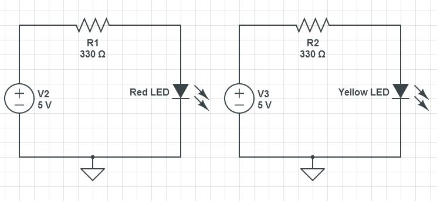

# Arduino Lesson 3: For Loops For Simple LED Circuit

In this lesson we will create a circuit and write Arduino code to control two LED’s.

 

 

In the earlier lessons we wrote our first programs and built our first circuit. At this time you should be getting comfortable with how the breadboard works and how to work with variables and digital Write commands in the Arduino IDE (Integrated Development Environment). Now we are going to build a slightly more complicated circuit for controlling two LEDs. Since we want to control each one individually, you will need to have a separate Arduino pin control each LED and each LED should have its own current limiting resistor (330 ohms). You should be able to sketch out your own circuit at this point. This is a diagram of the circuit we will be using. Yours does not have to be exactly like this, but it should have the same function.

 

 

Notice that in this circuit, the shorter leg of both LED’s needs to be connected to ground. In order to accomplish this we run a wire from the ground pin on the Arduino to the top row of the breadboard. This makes the top row “ground”. Now any device that needs to be grounded can just be connected to the top row, since that row of the breadboard is connected all the way across (See LESSON 1). Also note that both LED’s have their own 330 ohm current limiting resistor, and remember that the direction matters on diodes . . . be sure to put them in with the longer leg connected to the more positive part of the circuit . . . in this case, the longer leg should be connected to the resistor (since the resistor connects to the + voltage coming from the Arduino pin).

