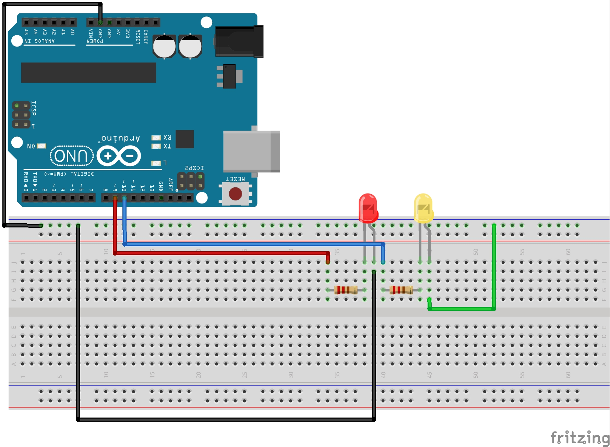
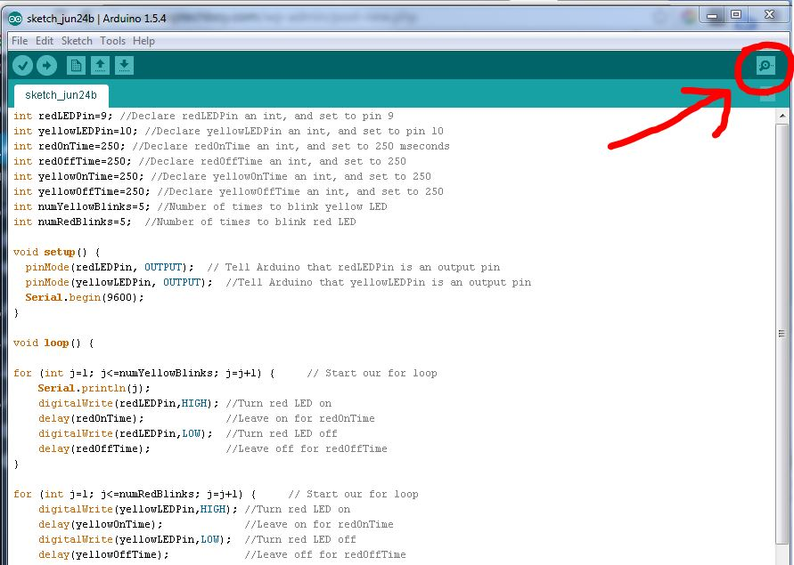
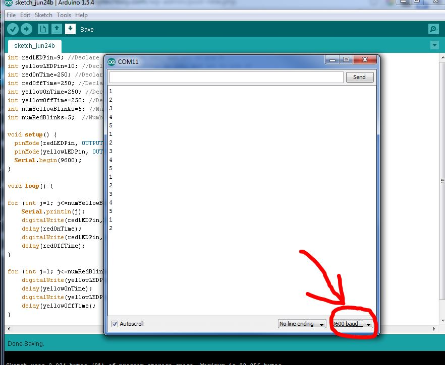

# Arduino Lesson 4 : Printing Over the Serial Port

In Lesson 3 you learned about for loops, and how for loops can make your life as a programmer much simpler.  You wrote a program that would blink a red LED and then a yellow LED the number of times indicated by the program. In this lesson, we will be using the same 2-LED circuit. If you don’s already have it put together, you should go ahead and do it now. This is a schematic of the circuit:

 

 

In order to use the Serial Port, the first thing you have to do is turn it on inside your program. Since this is something you would only need to do once, you do it in the void setup(). The code below, when placed inside the void setup() will turn your serial port on:

## - Serial.begin(9600);

You will want to keep whatever else you already have going on in your void setup(), and just add the line of code above to it. Note that this line of code tells the arduino to turn the serial port on. The ‘9600’ tells the arduino to communicate at 9600 baud, which basically is just the speed you will be working at. The higher the number the faster data will be sent and received over the serial port. This can be set to different numbers, but the important thing is that everyone is talking and listening at the same speed. So, if you tell the arduino to run at 9600 baud, when you open your serial monitor later, you need to make sure it is set to the same speed.

OK, now that you have started your serial monitor you can start sending and receiving data over it. The first and easiest thing is to send data to it. We do this using Serial.print and Serial.println commands. These commands send data to the arduino serial monitor. We will show you how to open the serial monitor in a minute, but for now, lets add some print statements to our program.

Notice that the loop above is our loop for blinking the red LED. We have added a new line to the start of the loop . . . Serial.println(j). After you add the line of code, download the code to the arduino, and then pop open your serial monitor. You do this by clicking on the magnifier icon at the upper right corner of the arduino IDE.

 

 

When you click on the icon you should see the serial monitor pop open, and you should see the values of j being printed out. It should look like this:

 

 

You should see the numbers printing out as your program goes through the for loop. Make sure that you have the baud rate set in the lower right corner of the serial monitor to the same value you specified in the program. 9600 baud is usually a good choice.

In the example above, we are printing the variable j each time the program loops through the for loop for the red LED. We can also print out a string of text. To print out a string of text, you put the string in quotes.  To print a string you would do something like Serial.println(“Blinking Red LED”). It will print the words between the quotes. Lets add this to our code, but lets add it before the for loop, so it just prints it once each cycle. Your code for the red LED should look like this:

