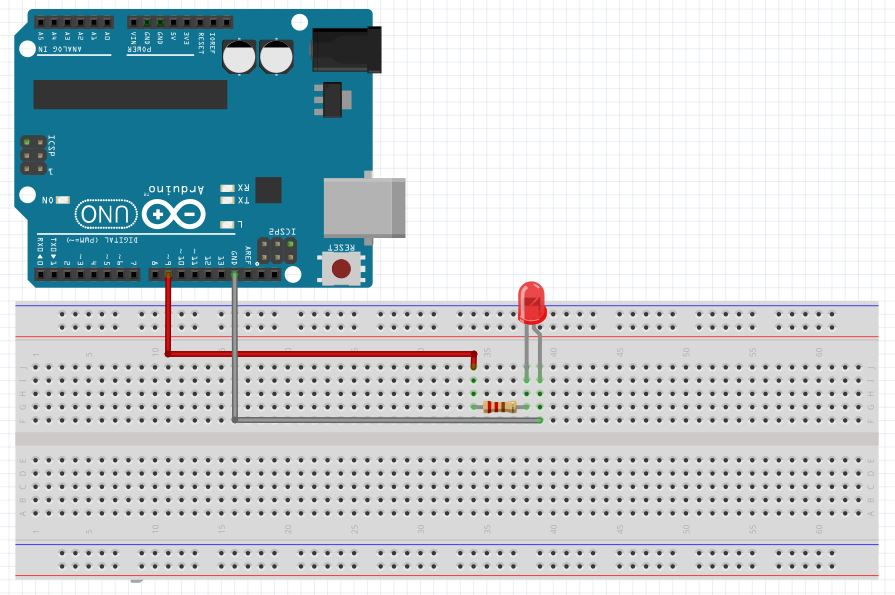

# ARDUINO LESSON 2: USING A BREADBOARD

In this lesson we will begin to build our first circuits that will be controlled by the Arduino. We will start out with simple circuits and build from there. It is important for you to learn the basics before moving on, and one of the most important basics is how to use a Breadboard.  In this lesson we will learn the ins and outs of breadboards, and by the end of the lesson you will have your first circuit built, and it will be controlled by the Arduino.  Watch the video below for in depth description of how the breadboard works.

 

 

LED Circuit
Simple LED Circuit for blinking an LED
So, lets look at a real example. In this circuit we have a voltage supply connected to an LED through a resistor. We will need to take this circuit schematic and figure out how to connect it up in the real world. As mentioned above this should be done using a breadboard. You can see that you need to connect the voltage supply to one leg of the resistor. The other leg of the resistor is connected to the LED. Note that the LED is directional, meaning it has to be connected in a certain orientation. You must connect the Cathode to the positive voltage. The Cathode is typically the longer of the two leads on the LED. If you put the LED in upside down, it will not light up. The other leg of the LED needs to be connected to the negative terminal of the voltage supply. For this project we will supply the voltage from the Arduino microcontroller. That way, we can turn the LED on and off from our program.

 

 

Look at the diagram at the top of this post to see how the holes are connected in the breadboard, and figure out a way you could connect the circuit up using the PC board. There are many ways to hook it up, but one that will work is shown here.

