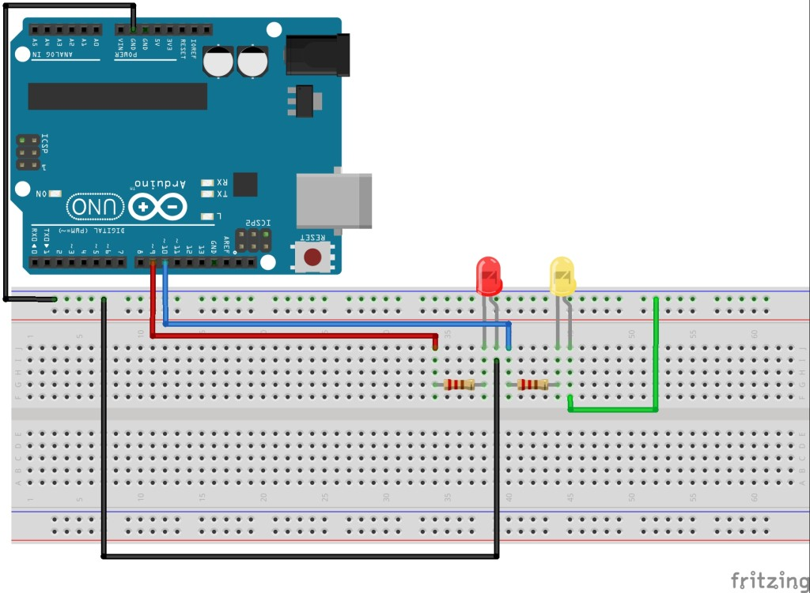

# ARDUINO LESSON 5: WORKING WITH STRINGS


<p align = "justify">
 We will learn more about working with stings. A string is literally a string or sequence of characters. The word “Hello” is a string of characters. Stings allow your computer program to interact with the world in a way that the world understands, so it is important for us to learn a little more about strings.
 </p>


 This is the code that will run this circuit.

 <p align="center">
 
 </p>


 ```ruby
 /*
  * Jerushan Sritharan
  * 2021.07.22
  * Arduino lesson - 04 : printing ove the serial port  
  */

 int redLED = 13;                                  // Declare redLED pin an int , and set to pin 13
 int yellowLED = 10;                               // Declare yellowLED pin an int . and set to pin 10
 int redLEDontime = 250;                           // Declare redLED on time an int and set to 250 mseconds
 int redLEDofftime = 250;                          // Declare redLEd off time an int and set to 250 mseconds
 int yellowLEDontime = 250;                        // Declare yellow LED on time an int and set to 250 mseconds
 int yellowLEDofftime = 250;                       // Declare yellow LED off time an int and set to 250 mseconds
 int numredLED = 5;                                // Number of time to red LED blink
 int numyellowLED = 5;                             // Number of time to yellow LED blink

 void setup (){
   Serial.begin (9600);                            //
   pinMode(redLED,OUTPUT);                         // Tell Arduino that redLED pin is a output pin
   pinMode (yellowLED,OUTPUT);                     // Tel Arduino that yellow LED is a output pin
   }


 void loop () {
   Serial.println ("The red led is blinking $");
   for (int j=1; j<=numredLED; ++j){                //start our for loop
   Serial.print ("   you are on blink # : ");       //
   Serial.println (j);                              //
   digitalWrite (redLED,HIGH);                      //Red LED turn on
   delay (redLEDontime);                            //Give the wait time
   digitalWrite (redLED,LOW);                       //Red LED turn off            
   delay (redLEDofftime);                           //Give the wait time
   }

 Serial.println (" ");                              //

 for (int r=1; r<=numyellowLED; ++r){               //Strart the for loop
   Serial.println(r);                               //
   digitalWrite (yellowLED,HIGH);                   //yellow LED turn on
   delay (yellowLEDontime);                         //Give the wait seconds
   digitalWrite (yellowLED,LOW);                    //Yellow LED turn off
   delay (yellowLEDofftime);                        //Give the wait seconds
 }
 Serial.println (" ");                              //

   }

 ```

In the code above, notice that we are using stings in some of our print statements. For example the line of code above the for loop for blinking the red LED reads as:

```ruby
Arduino
Serial.println("The Red LED is Blinking");

````

<p align = "justify">
The text in quotes is your string, and in this case is “The Red LED is Blinking”.  As you can see a string is just a string of characters. We can use strings to present meaningful words and thoughts to the user.  We are not limited to just using strings as we have above,  but we can actually create variables to hold strings. For example, in the code above one of the strings we print for the user to see is “The Red LED is Blinking”. It would be possible for us to create a variable called redMessage, and set redMessage to “The Red LED is Blinking”. In order to do this, we would need to declare the variable redMessage a string. We can do that up at the top of the program before the void setup, which would make it a global variable. The code would look like this:
</p>


````ruby
String redMessage="The Red LED is Blinking";
String yellowMessage="The Yellow LED is Blinking";
````

<p align = "justify">
With this code we declare two new variables of type String. In addition to declaring the variables we initialize them to their respective values. By doing this we can modify our print statements in the original code to print the Strings by printing the variables we have assigned them to.

````ruby
Serial.println("The Red LED is Blinking");
````
can be replaced with

````ruby
Serial.println(redMessage);
````
<p align = "justify">
Notice when we print the variable, we do not use quotes around it. When we say to print redMessage, it will print the string that was assigned to redMessage.

<p align = "justify">
By assigning strings to variables instead of using them directly it makes it much easier to modify and use your code. Try and get in the habit of assigning strings to variables.

When we have string variables, it is possible to concatenate, or combine stings together.

For example, lets say we declare and initialize two variables:


```ruby
String st1="Hello"; //Create a Strign st1 and set to "Hello "
String st2="World"; //Create a String st2 and set to "World"
String st3;         //Declare a String st3 but dont assign value to it yet.

// Now In your void loop add this

st3=st1+st2;      //Combine st1 and st2 into a new variable st3
Serial.println(st3); // Print out st32
```
It is a good practice to try to assign strings to variables and then use the variables.
